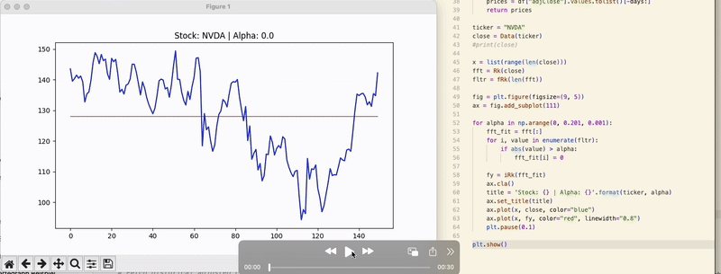

# Fourier Analysis to approximate stock prices (fourier.py)

**(pure mathematics) - no machine!!**

## What even is Fourier Transform?

The Fourier Transform is a mathematical technique that decomposes a time-series signal (like stock prices) into a sum of sine and cosine waves of varying frequencies. In simple terms:

- **Low frequencies** represent general trends and slow movements.
- **High frequencies** represent noise or rapid fluctuations.

By transforming the signal into the frequency domain and **removing high-frequency components**, we can reconstruct a smoother version of the stock price — effectively filtering out noise.

## Advantages

- Noise Reduction: Helps to remove short-term volatility (random fluctuations), revealing long-term trends.
- Signal Compression: Allows you to approximate the price series using fewer components.
- Cycle Detection: Can reveal hidden periodic patterns in the price data.
- Data Smoothing: Useful for trend-following strategies by removing erratic changes.

## Disadvantages

- Assumes Stationarity: Fourier analysis assumes that the statistical properties of the signal don’t change over time — which is rarely true in financial markets.
- Poor at Local Changes: It has global basis functions (sine/cosine), so it doesn't capture sudden shocks or events well.
- Not Predictive Alone: While it helps reveal structure, it doesn't predict future prices on its own. It's a filtering tool, not a forecasting model.
- Ignores External Factors: Fourier Transform is purely mathematical and doesn't consider news, earnings, or macroeconomic factors.

## How it works

```python
def Rk(prices):
    # Custom Discrete Fourier Transform (DFT)
```

- Converts time-domain stock prices into the frequency domain

```python
def fRk(N, d=1.0):
    # Frequency mapping
```

- Maps each frequency component's value for filtering.

```python
def iRk(prices):
    # Inverse DFT to reconstruct filtered prices
```

- Rebuilds the smoothed price data after removing high-frequency noise.

## Formulas

$
R(k) = \sum*{n=1}^N P_n e^{1 j \left(-2 \pi k n / N\right)} \\
f_R(k) =
\begin{cases}
\frac{k}{N d} & \text{if } k \leq \frac{N}{2} \\
\frac{k - N}{N d} & \text{otherwise}
\end{cases} \\
i_R(k) = \frac{\sum*{i=1}^N P_f v^{\frac{1}{2} \left(2 t n / N\right)}}{N}
$


